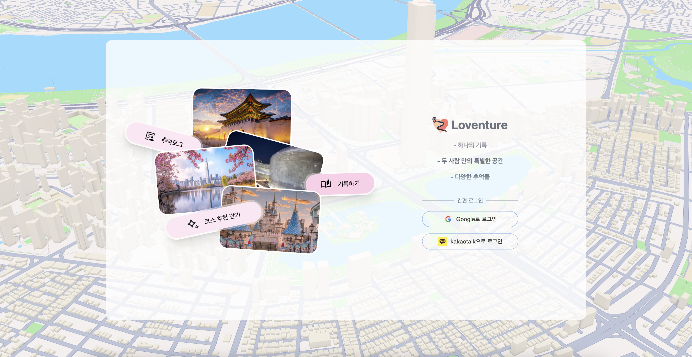

# Loventure / Frontend

<div align="center">

**AI 기반 커플 맞춤형 데이트 코스 추천 서비스**

[](https://reactjs.org/)
[](https://www.typescriptlang.org/)
[](https://vitejs.dev/)
[](https://tanstack.com/query)

</div>



---

## 📖 목차

- [프로젝트 소개](#-프로젝트-소개)
- [주요 기능](#-주요 기능)
- [기술 스택](#️-기술-스택)
- [프로젝트 구조](#-프로젝트-구조)
- [시작하기](#-시작하기)
- [사용자 플로우](#-사용자-플로우)
- [주요 페이지](#-주요-페이지)
- [상태 관리](#-상태-관리)
- [API 통신](#-api-통신)
- [개발 환경 설정](#-개발-환경-설정)
- [기여하기](#-기여하기)

---

## 🎯 프로젝트 소개

**Loventure**는 AI가 커플의 취향과 선호도를 분석하여 최적화된 데이트 코스를 추천해주는 웹 애플리케이션입니다. 

사용자의 **온보딩 정보**(활동량, 음주 선호도, 가격대, 분위기 등)와 **실시간 데이트 옵션**(시간, 컨디션, 음주 의향, 불호음식)을 종합하여 서울 지역 내 맞춤형 데이트 코스를 제공합니다.

### 핵심 가치

- 🎯 **개인화된 추천**: 커플의 취향과 조건을 고려한 AI 기반 코스 추천
- 🗺️ **인터랙티브 지도**: Mapbox 기반 실시간 경로 시각화
- 🔒 **게이미피케이션**: 서울 25개 구를 단계적으로 해금하는 지역락 시스템
- 💑 **커플 중심**: 커플 룸 생성 및 공유 기능
- 📝 **추억 저장**: 다녀온 코스를 다이어리로 기록하고 공유

---

## ✨ 주요 기능

### 1. 🗺️ 지도 기반 코스 추천
- **시작점 선택**: 메인 지도에서 원하는 위치를 클릭하여 데이트 시작점 설정
- **경로 시각화**: Mapbox를 활용한 실시간 경로 렌더링 및 거리/시간 표시
- **서울 25개 구 지원**: 단계적으로 해금되는 지역락 시스템

### 2. 💑 커플 매칭 시스템
- **커플 룸 생성**: 커플 이름과 사귄 날짜 설정
- **초대 코드 공유**: 생성된 초대 코드로 파트너 매칭
- **커플 홈**: 함께 저장한 코스와 추억 공유

### 3. 🎨 온보딩 & 취향 설정
- **5단계 취향 설문**: 음주 선호도, 활동량, 가격대, 선호 음식, 분위기 등
- **실시간 진행도**: 프로그레스 바로 답변 완료 상태 확인
- **언제든 수정 가능**: 마이페이지에서 취향 재설정

### 4. 🎯 실시간 코스 추천
- **옵션 설정**:
  - 데이트 시간 (시작/종료)
  - 오늘의 컨디션 (1-10 슬라이더)
  - 음주 의향
  - 불호 음식 (선택사항)
- **AI 분석**: 온보딩 정보 + 실시간 옵션을 결합한 최적 코스 생성
- **다양한 정보 제공**: 카테고리, 가격대, 실내/외, 음주 가능 여부, 영업시간, 평점 등

### 5. 💾 코스 저장 & 관리
- **코스 저장**: 마음에 드는 추천 코스를 저장
- **저장된 코스 목록**: 저장한 모든 코스를 카드 형식으로 조회
- **재추천 기능**: 코스 내 특정 장소만 교체 가능

### 6. 📖 추억 다이어리
- **다이어리 작성**: 다녀온 코스를 기록 (제목, 내용, 평점, 이미지)
- **마크다운 지원**: 풍부한 텍스트 편집 기능
- **댓글 기능**: 커플끼리 댓글로 소통
- **페이지네이션**: 효율적인 다이어리 목록 관리

### 7. 👤 마이페이지
- **프로필 관리**: 닉네임, 생일 등 개인 정보 수정
- **취향 재설정**: 온보딩 정보 업데이트
- **커플 정보**: 커플 홈 이름, 사귄 날짜 수정
- **지역락 관리**: 티켓으로 새로운 지역 해금

### 8. 🔒 지역락 시스템
- **초기 2개 해금**: 첫 설정 시 서울 25개 구 중 2곳 선택
- **티켓 시스템**: 코스 저장 시 티켓 획득
- **단계적 해금**: 티켓으로 추가 지역 해제

### 9. 🔐 인증 & 권한 관리
- **다단계 인증 플로우**:
  1. `ONBOARDING_REQUIRED`: 취향 설정 필요
  2. `COUPLE_MATCHING_REQUIRED`: 커플 매칭 필요
  3. `ROCK_REQUIRED`: 지역락 해제 필요
  4. `COMPLETED`: 모든 단계 완료
- **PrivateRoute**: 권한별 라우트 보호
- **자동 리다이렉트**: 사용자 상태에 따른 페이지 이동

---

## 🛠️ 기술 스택

### Core
- **[React 19.1.1](https://reactjs.org/)** - UI 라이브러리
- **[TypeScript 5.9.2](https://www.typescriptlang.org/)** - 타입 안정성
- **[Vite 7.1.2](https://vitejs.dev/)** - 빌드 도구 및 개발 서버

### State Management
- **[TanStack Query 5.89.0](https://tanstack.com/query)** - 서버 상태 관리 및 데이터 캐싱
- **[Zustand 5.0.8](https://zustand-demo.pmnd.rs/)** - 클라이언트 상태 관리

### Routing
- **[React Router DOM 7.9.1](https://reactrouter.com/)** - SPA 라우팅

### UI/UX
- **[Tailwind CSS 3.4.17](https://tailwindcss.com/)** - 유틸리티 기반 스타일링
- **[Material-UI 7.3.2](https://mui.com/)** - UI 컴포넌트 라이브러리
- **[Emotion 11.14.0](https://emotion.sh/)** - CSS-in-JS
- **[FontAwesome 7.0.1](https://fontawesome.com/)** - 아이콘
- **[classnames 2.5.1](https://github.com/JedWatson/classnames)** - CSS 클래스 조건부 렌더링
- **[clsx 2.1.1](https://github.com/lukeed/clsx)** - 빠른 CSS 클래스 결합

### Maps & Location
- **[Mapbox GL JS 3.15.0](https://docs.mapbox.com/mapbox-gl-js/)** - 인터랙티브 지도

### Data & Forms
- **[Axios 1.12.2](https://axios-http.com/)** - HTTP 클라이언트
- **[Date-fns 4.1.0](https://date-fns.org/)** - 날짜 처리

### Developer Experience
- **[ESLint 9.33.0](https://eslint.org/)** - 코드 품질 및 스타일 검사
- **[TypeScript ESLint](https://typescript-eslint.io/)** - TypeScript용 ESLint 플러그인
- **[MSW 2.11.3](https://mswjs.io/)** - API 모킹
- **[React Query Devtools 5.89.0](https://tanstack.com/query/latest/docs/react/devtools)** - 쿼리 디버깅
- **[React Toastify 11.0.5](https://fkhadra.github.io/react-toastify/)** - 토스트 알림
- **[PostCSS 8.5.6](https://postcss.org/)** - CSS 변환 도구
- **[Autoprefixer 10.4.21](https://github.com/postcss/autoprefixer)** - CSS 자동 벤더 프리픽스

### Markdown & Rich Text
- **[React Markdown 10.1.0](https://remarkjs.github.io/react-markdown/)** - 마크다운 렌더링
- **[Remark GFM 4.0.1](https://github.com/remarkjs/remark-gfm)** - GitHub Flavored Markdown

---

## 📁 프로젝트 구조

```
src/
├── app/                          # 앱 설정 및 레이아웃
│   ├── layouts/                 # 공통 레이아웃 컴포넌트
│   │   ├── HeaderLayout.tsx    # 헤더 및 사이드바 레이아웃
│   │   └── index.ts            # 레이아웃 export
│   └── providers/               # 전역 프로바이더
│       ├── AuthBootstrap.tsx   # 인증 초기화 및 OAuth 처리
│       └── PrivateRoute.tsx    # 권한 기반 라우트 보호
│
├── features/                     # 기능별 모듈 (Feature-Sliced Design)
│   ├── auth/                    # 인증 관련
│   │   ├── api.ts              # 인증 API
│   │   ├── assets/             # 로그인 배경 이미지
│   │   ├── components/         # 로그인 UI 컴포넌트
│   │   └── types.ts            # 인증 타입 정의
│   │
│   ├── course/                  # 코스 추천 관련
│   │   ├── api.ts              # 코스 API
│   │   ├── components/         # 코스 관련 컴포넌트
│   │   │   ├── CourseDetailSidebar.tsx
│   │   │   ├── CourseListItem.tsx
│   │   │   ├── PlaceDetailModal.tsx
│   │   │   ├── PlaceDetailSidebar.tsx
│   │   │   └── SessionCoursesModal.tsx
│   │   ├── mocks/              # 코스 Mock 데이터
│   │   ├── types/              # 코스 타입 정의
│   │   └── utils/              # 코스 유틸리티
│   │
│   ├── coupleroom/              # 커플 룸 관련
│   │   ├── api.ts              # 커플 룸 API
│   │   ├── mocks/              # 커플 룸 Mock 데이터
│   │   └── types.ts            # 커플 룸 타입
│   │
│   ├── diary/                   # 다이어리 관련
│   │   ├── api.ts              # 다이어리 API
│   │   ├── components/         # 다이어리 UI 컴포넌트
│   │   ├── mocks/              # 다이어리 Mock 데이터
│   │   └── types.ts            # 다이어리 타입
│   │
│   ├── district/                # 지역(구) 관련
│   │   ├── api.ts              # 지역락 API
│   │   ├── components/         # 지역 선택 UI (DistrictLock.tsx)
│   │   └── mocks/              # 지역 Mock 데이터
│   │
│   ├── mapbox/                  # 지도 관련
│   │   ├── api.ts              # 지도 API
│   │   ├── components/         # 지도 컴포넌트
│   │   │   ├── MainMapbox.tsx  # 메인 지도
│   │   │   ├── LoginMapbox.tsx # 로그인 배경 지도
│   │   │   └── RecommendMapbox.tsx # 추천 코스 지도
│   │   ├── index.ts
│   │   └── types.ts            # 지도 타입
│   │
│   ├── mypage/                  # 마이페이지 관련
│   │   ├── api.ts              # 마이페이지 API
│   │   ├── components/         # 마이페이지 컴포넌트
│   │   │   ├── Profile.tsx     # 프로필 섹션
│   │   │   ├── PersonalPreferences.tsx  # 취향 설정
│   │   │   └── CoupleHome.tsx  # 커플 정보
│   │   ├── index.ts            # API export
│   │   └── mocks/              # 마이페이지 Mock 데이터
│   │
│   ├── onboarding/              # 온보딩 관련
│   │   ├── api.ts              # 온보딩 API
│   │   └── PersonalOnboarding.tsx  # 온보딩 UI 컴포넌트
│   │
│   └── option/                  # 옵션 설정 관련
│       ├── api.ts              # 옵션 API
│       ├── types.ts            # 옵션 타입
│       └── utils/              # 옵션 유틸리티
│           └── sessionStorage.ts  # 옵션 세션 관리
│
├── pages/                        # 페이지 컴포넌트
│   ├── LoginPage/               # 로그인 페이지
│   ├── MainPage/                # 메인 페이지 (지도)
│   ├── OnboardingPage/          # 온보딩 페이지
│   ├── CoupleRoomPage/          # 커플 룸 페이지
│   ├── DistrictPage/            # 지역 선택 페이지
│   ├── OptionsPage/             # 옵션 설정 페이지
│   ├── RecommendCoursePage/     # 코스 추천 페이지
│   ├── CourseListPage/          # 코스 목록 페이지
│   ├── CourseDetailPage/        # 코스 상세 페이지
│   ├── DiaryPage/               # 다이어리 페이지
│   │   ├── DiaryListPage.tsx   # 다이어리 목록
│   │   ├── CreateDiaryPage.tsx # 다이어리 작성
│   │   └── UpdateDiaryPage.tsx # 다이어리 수정
│   ├── DiaryDetailPage/         # 다이어리 상세 페이지
│   └── MyPage/                  # 마이페이지
│
├── shared/                       # 공통 모듈
│   ├── api/                     # API 관련
│   │   ├── base.ts             # Axios 인스턴스 + 인터셉터
│   │   ├── raw.ts              # Raw Axios (인터셉터 없음)
│   │   ├── routes.api.ts       # Mapbox Directions API
│   │   └── type.ts             # API 타입
│   │
│   ├── config/                  # 전역 설정
│   │   └── env.ts              # 환경 변수 관리
│   │
│   ├── lib/                     # 라이브러리
│   │   └── tokenStore.ts       # 토큰 저장소
│   │
│   ├── store/                   # Zustand 상태 관리
│   │   ├── auth.store.ts       # 인증 상태
│   │   ├── CoupleRoom.store.ts # 커플 룸 상태
│   │   ├── diary.store.ts      # 다이어리 상태
│   │   ├── district.store.ts   # 지역 상태
│   │   ├── header.store.ts     # 헤더 상태
│   │   ├── mapbox.store.ts     # 지도 상태 (마커, 장소 선택)
│   │   ├── mypage.store.ts     # 마이페이지 상태
│   │   ├── onboarding.store.ts # 온보딩 상태
│   │   ├── recommend.store.ts  # 추천 상태 (세션 관리 포함)
│   │   ├── useRecommendStore.ts # 추천 상태
│   │   ├── ui.store.ts         # UI 상태
│   │   └── type.ts             # 모든 타입 통합 (단방향 의존성 보장)
│   │
│   ├── types/                   # 공통 타입
│   │   └── http.ts             # HTTP 관련 타입
│   │
│   ├── ui/                      # 공통 UI 컴포넌트
│   │   ├── button/             # 버튼 컴포넌트
│   │   ├── input/              # 인풋 컴포넌트
│   │   ├── spinner/            # 스피너 컴포넌트
│   │   ├── image-upload/       # 이미지 업로드 컴포넌트
│   │   ├── markdown-editor/    # 마크다운 에디터
│   │   └── assets/             # 공통 에셋
│   │
│   └── utils/                   # 공통 유틸리티
│       ├── authRedirect.ts     # 인증 리다이렉트 로직
│       └── sessionStorage.ts   # 추천 코스 세션 관리
│
├── mocks/                        # MSW 모킹
│   ├── browser.ts              # MSW 브라우저 설정
│   └── handlers.ts             # API 핸들러 (600+ lines)
│
├── App.tsx                       # 앱 라우팅
├── main.tsx                      # 앱 진입점
└── index.css                     # 전역 스타일
```

### 아키텍처 특징

1. **Feature-Sliced Design**: 기능별로 모듈을 분리하여 높은 응집도와 낮은 결합도 유지
2. **Layered Architecture**: `features` → `shared` 단방향 의존성
3. **Colocation**: 관련 파일들을 같은 디렉토리에 배치 (컴포넌트, API, 타입, 훅 등)
4. **Separation of Concerns**: 비즈니스 로직, UI, 상태 관리 분리

---

## 🚀 시작하기

### 필수 요구사항

- **Node.js**: 18.0.0 이상
- **npm** 또는 **yarn**
- **Mapbox Access Token**: [Mapbox](https://www.mapbox.com/) 계정 필요

### 설치 및 실행

1. **저장소 클론**

```bash
git clone https://github.com/your-org/PitterPetter_FE.git
cd PitterPetter_FE
```

2. **의존성 설치**

```bash
npm install
```

3. **환경 변수 설정**

프로젝트 루트에 `.env` 파일을 생성하고 다음 내용을 추가하세요:

```env
# API 서버 URL
VITE_API_BASE_URL=https://api.loventure.us

# Mapbox Access Token
VITE_MAPBOX_ACCESS_TOKEN=your_mapbox_access_token_here

# API 타임아웃 (밀리초, 선택사항)
VITE_API_TIMEOUT=80000
```

4. **개발 서버 실행**

```bash
npm run dev
```

개발 서버가 실행되면 브라우저에서 `http://localhost:5173`로 접속하세요.

5. **프로덕션 빌드**

```bash
npm run build
```

빌드된 파일은 `dist/` 디렉토리에 생성됩니다.

6. **프로덕션 미리보기**

```bash
npm run preview
```

---

## 🔄 사용자 플로우

```
┌─────────────────────────────────────────────────────────────────────┐
│                           사용자 플로우                              │
└─────────────────────────────────────────────────────────────────────┘

1. 로그인 (Google/Kakao OAuth)
   ↓
2. 온보딩 (취향 설정 - 5단계)
   - 음주 선호도
   - 활동량
   - 가격대 선호
   - 선호 음식
   - 선호 분위기
   ↓
3. 커플 매칭
   - 커플 룸 생성 OR 초대 코드 입력
   ↓
4. 지역락 해제
   - 서울 25개 구 중 2곳 선택
   ↓
5. 메인 페이지 (지도)
   - 시작점 클릭
   ↓
6. 옵션 설정
   - 시간 (시작/종료)
   - 컨디션
   - 음주 의향
   - 불호 음식
   ↓
7. 코스 추천
   - AI 분석 결과 확인
   - 경로 및 장소 정보 보기
   ↓
8. 코스 저장
   - 티켓 획득 (추가 지역 해금 가능)
   ↓
9. 다이어리 작성
   - 다녀온 코스 기록
   - 이미지 업로드
   - 평점 작성
```

---

## 📄 주요 페이지

### 1. 로그인 페이지 (`/login`)

- Google/Kakao 소셜 로그인
- 배경에 Mapbox 애니메이션
- 로그인 성공 시 사용자 상태에 따라 자동 리다이렉트

### 2. 온보딩 페이지 (`/onboarding`)

- 5단계 취향 설문
- 실시간 진행도 표시 (프로그레스 바)
- 최소 5개 답변 필수
- 완료 시 `COUPLE_MATCHING_REQUIRED` 상태로 전환

### 3. 커플 룸 페이지 (`/coupleroom`)

#### 생성 (`/coupleroom/create`)
- 커플 홈 이름 및 사귄 날짜 입력
- 초대 코드 자동 생성

#### 입장 (`/coupleroom/enter`)
- 초대 코드 입력
- 유효성 검증 후 매칭

#### 코드 확인 (`/coupleroom/create/:id`)
- 생성된 초대 코드 표시
- 클립보드 복사 기능

### 4. 지역 선택 페이지 (`/district`)

#### 선택 (`/district/choose`)
- 서울 25개 구 중 2곳 선택
- 선택 완료 시 `COMPLETED` 상태로 전환

#### 확인 (`/district/check`)
- 현재 해금된 지역 확인
- 티켓으로 추가 지역 해제

### 5. 메인 페이지 (`/home`)

- Mapbox 기반 서울 지도
- 클릭하여 시작점 선택
- 선택한 구역 표시
- 잠긴 구역 안내
- "코스 추천받기" 버튼

### 6. 옵션 설정 페이지 (`/options`)

- **시간 설정**: TimePicker로 시작/종료 시간 선택
- **컨디션**: 1-10 슬라이더
- **음주 여부**: 토글 버튼
- **불호 음식**: 텍스트 입력 (선택사항)
- 제출 시 AI 추천 API 호출

### 7. 코스 추천 페이지 (`/recommend`)

- Mapbox로 경로 시각화
- 코스 정보 패널 (총 거리, 총 시간)
- 사이드바: 추천 장소 리스트
  - 순서, 이름, 카테고리
  - 가격대, 음주 가능 여부, 실내/외
  - 평점, 분위기, 음식 태그
- 장소 클릭 시 상세 모달
- **Save this course** 버튼
- **Rerecommend** 버튼 (특정 장소 교체)

### 8. 코스 목록 페이지 (`/course`)

- 저장된 코스 카드 리스트
- 썸네일, 제목, 설명, 좋아요 수
- 카드 클릭 시 상세 페이지로 이동

### 9. 코스 상세 페이지 (`/course/:id`)

- 코스 전체 경로 지도
- 장소 리스트 및 상세 정보
- 좋아요 기능

### 10. 다이어리 목록 페이지 (`/diary`)

- 페이지네이션된 다이어리 카드
- 썸네일, 제목, 요약, 댓글 수
- "다이어리 작성" 버튼

### 11. 다이어리 작성 페이지 (`/diary/create`)

- 제목, 내용 (마크다운 에디터)
- 코스 선택 (저장된 코스 중)
- 평점 (별점)
- 이미지 업로드

### 12. 다이어리 수정 페이지 (`/diary/update/:id`)

- 기존 다이어리 정보 로드
- 수정 및 저장

### 13. 다이어리 상세 페이지 (`/diary/:id`)

- 다이어리 전체 내용 표시
- 마크다운 렌더링
- 이미지 표시
- 댓글 섹션
  - 댓글 작성
  - 댓글 수정/삭제 (본인만)

### 14. 마이페이지 (`/mypage`)

- **프로필 섹션**: 닉네임, 생일 수정
- **취향 재설정**: 온보딩 정보 업데이트
- **커플 정보**: 커플 홈 이름, 사귄 날짜 수정
- **지역락 관리**: 현재 티켓 개수, 지역 해금

---

## 🗂️ 상태 관리

### Zustand Stores

프로젝트는 **Zustand**를 사용하여 클라이언트 상태를 관리합니다.

#### 1. `auth.store.ts` - 인증 상태

```typescript
interface AuthStore {
  permissionLevel: "ONBOARDING_REQUIRED" | "COUPLE_MATCHING_REQUIRED" | "ROCK_REQUIRED" | "COMPLETED" | null;
  setPermissionLevel: (level: ...) => void;
}
```

#### 2. `mapbox.store.ts` - 지도 상태

- 마커 위치
- 선택된 장소
- 지도 준비 상태

#### 3. `recommend.store.ts` - 추천 상태

- 추천 코스 데이터
- AI 설명
- 선택된 장소

#### 4. `onboarding.store.ts` - 온보딩 상태

- 음주 선호도
- 활동량
- 가격대
- 선호 음식
- 분위기
- 답변 완료 수

#### 5. `district.store.ts` - 지역 상태

- 선택된 구역
- 잠금 상태

#### 6. `header.store.ts` - 헤더 상태

- 사이드바 열림/닫힘

#### 7. `ui.store.ts` - UI 상태

- 로딩 상태
- 지도 준비 상태

### TanStack Query

**서버 상태 관리**를 위해 사용:

- API 호출 및 캐싱
- 자동 리페칭
- 낙관적 업데이트
- 로딩/에러 상태 관리

주요 쿼리 키:
- `['authStatus']` - 인증 상태
- `['courses']` - 코스 목록
- `['diaries', page, size]` - 다이어리 목록
- `['diaryDetail', id]` - 다이어리 상세
- `['route', lng1, lat1, lng2, lat2]` - Mapbox 경로

---

## 🌐 API 통신

### Axios 인터셉터

`shared/api/base.ts`에서 Axios 인스턴스를 설정:

1. **Request Interceptor**: Access Token을 `Authorization` 헤더에 자동 주입
2. **Response Interceptor**: 
   - 401/419/440 에러 시 자동 토큰 갱신
   - Refresh Token은 httpOnly 쿠키로 관리
   - 갱신 실패 시 로그인 페이지로 리다이렉트

### API 엔드포인트

| 메서드 | 경로 | 설명 |
|--------|------|------|
| GET | `/api/auth/redirect/status` | 사용자 인증 상태 조회 |
| POST | `/api/onboarding/me` | 온보딩 정보 저장 |
| POST | `/api/couples/room` | 커플 룸 생성 |
| POST | `/api/couples/match` | 커플 매칭 (초대 코드) |
| GET | `/api/regions/search` | 지역락 상태 조회 |
| POST | `/api/regions/unlock/init` | 초기 지역 해제 (2개) |
| POST | `/api/regions/unlock/reward` | 티켓으로 지역 해제 |
| POST | `/api/recommends` | 코스 추천 요청 |
| POST | `/api/courses` | 코스 저장 |
| GET | `/api/courses` | 코스 목록 조회 |
| POST | `/api/recommends/replace` | 코스 재추천 (특정 장소 교체) |
| POST | `/api/couples/ticket/add` | 티켓 추가 |
| GET | `/api/diaries` | 다이어리 목록 조회 |
| POST | `/api/diaries` | 다이어리 생성 |
| GET | `/api/diaries/:id` | 다이어리 상세 조회 |
| PUT | `/api/diaries/:id` | 다이어리 수정 |
| DELETE | `/api/diaries/:id` | 다이어리 삭제 |
| POST | `/api/diaries/:id/comments` | 댓글 작성 |
| PUT | `/api/diaries/:diaryId/comments/:commentId` | 댓글 수정 |
| DELETE | `/api/diaries/:diaryId/comments/:commentId` | 댓글 삭제 |
| GET | `/api/auth/mypage` | 마이페이지 조회 |
| PUT | `/api/auth/profile` | 프로필 수정 |
| DELETE | `/api/couples/cancel` | 커플 헤어지기 |
| PUT | `/api/couples` | 커플 정보 수정 |

---

## 🔧 개발 환경 설정

### MSW (Mock Service Worker)

개발 환경에서 **MSW**를 사용하여 API를 모킹합니다.

- `src/mocks/handlers.ts`: 600+ lines의 API 핸들러
- `src/mocks/browser.ts`: MSW 브라우저 설정
- Mock Store: 메모리 기반 데이터 저장소

MSW는 `main.tsx`에서 자동으로 시작됩니다 (DEV 환경만).

### Tailwind CSS

`tailwind.config.js`에서 커스텀 색상 정의:

```javascript
backgroundColor: {
  'primary': '#662B2B',    // 메인 색상 (와인)
  'secondary': '#FFEDED',  // 보조 색상 (연한 핑크)
  'third': '#93000A'       // 강조 색상 (진한 빨강)
}
```

### Git Hooks

(선택사항) Husky를 사용한 pre-commit 훅 설정 가능

---

## 🤝 기여하기

1. **Fork the Project**
2. **Create your Feature Branch** 
   ```bash
   git checkout -b feature/AmazingFeature
   ```
3. **Commit your Changes** 
   ```bash
   git commit -m 'feat: Add some AmazingFeature'
   ```
4. **Push to the Branch** 
   ```bash
   git push origin feature/AmazingFeature
   ```
5. **Open a Pull Request**

### 커밋 컨벤션

```
feat: 새로운 기능 추가
fix: 버그 수정
docs: 문서 수정
style: 코드 포매팅, 세미콜론 누락 등
refactor: 코드 리팩토링
test: 테스트 코드 추가
chore: 빌드 업무, 패키지 매니저 설정 등
```

---

## 📞 문의

프로젝트에 대한 문의사항이 있으시면 Issue를 생성해 주세요.

---

## 📝 라이센스

이 프로젝트는 비공개 저작물입니다.

---

<div align="center">

**Made with ❤️ by Loventure Team**

</div>
